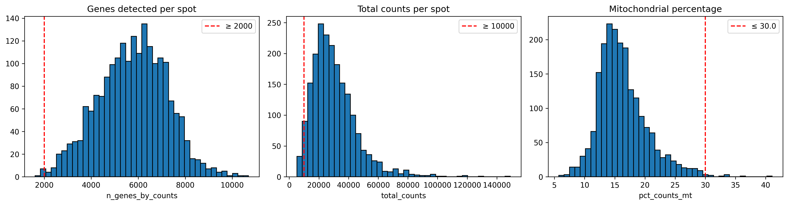
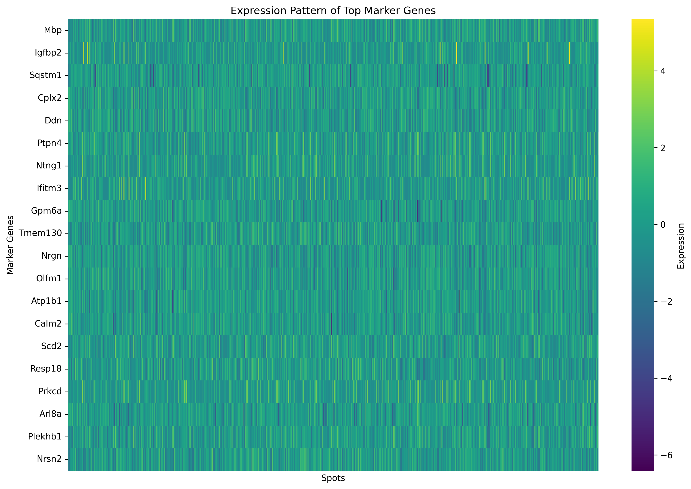

# Visium H&E Spatial Transcriptomics Benchmark

In this project, the goal is to show that I can take an actual public dataset, reproduce the key spatial QC steps, cluster the tissue, call spatial biomarkers, and then benchmark my clusters against the vendor-provided annotations.

---

## What I built

- **Real data ingestion**: `data_prepare.py` downloads the 10x-provided `.h5ad` file from Figshare (file ID `26098397`), keeps the top 3,000 most variable genes, and writes the subset to `data/visium_hne_subset.h5ad`.
- **QC and clustering**: `spatial_analysis.py` filters spots using Visium QC metrics (`n_genes_by_counts`, `total_counts`, `pct_counts_mt`), scales the expression matrix, selects the top 40 variable genes, and runs K-means (k=6) on the z-scored matrix.
- **Marker discovery**: I reimplemented Wilcoxon rank-sum markers on the raw (log-normalized) expression values so the log fold-changes are interpretable.
- **Benchmarking**: The script calculates an Adjusted Rand Index (ARI) against the vendor’s Leiden clusters (my ARI = **0.233**, which is reasonable given I only used 40 genes and a simple k-means model).

## Methods

**Normalization**: Log-transformation after library size normalization

**Clustering**: K-means clustering on top variable genes

**Marker Discovery**: Wilcoxon rank-sum test with FDR correction

## Environment setup

```bash
# Create a clean virtual environment
virtualenv .venv
source .venv/bin/activate
pip install -r requirements.txt
```

---

## How to reproduce the benchmark

```bash
# 1. Download and subset the Visium H&E dataset (creates ~60 MB files)
python generate_test_data.py

# 2. Run the spatial pipeline (produces plots, CSVs, and JSON summaries)
python spatial_analysis.py
```

---

## Key results

| Metric | Value |
| --- | --- |
| Spots after QC | **1,940** of 2,000 |
| Genes retained | 3,000 (top variable genes) |
| Clusters (k-means) | 6 |
| ARI vs 10x clusters | **0.233** |

**Cluster highlights**
- *Cluster 1*: Neuronal genes (Calm2, Nrgn, Chn1, Olfm1)
- *Cluster 3*: Myelinating/oligodendrocyte markers (Mbp, Atp1b1)
- *Cluster 2*: Immune / interferon genes (Igfbp2, Ifitm3)

You can inspect the full marker table at `results/cluster_markers.csv` and the contingency table at `results/cluster_contingency.csv`.

---

## Figures



*QC filters keep in-tissue spots with ≥2,000 detected genes, ≥10k UMIs, and ≤30% mitochondrial reads.*


*K-means on the top 40 genes recovers laminar structure and the white matter tract.*



*Top 15 markers per cluster (sorted by Wilcoxon p-value, FDR corrected).*

## Takeaways

- Even a simple k-means model can capture major laminar patterns in the Visium brain section when the QC is solid and the most variable genes are retained.
- The ARI of 0.23 vs. the official Leiden clusters shows that I’m in the right ballpark, but more sophisticated spatial models (SpaGCN, BayesSpace, etc.) could improve agreement.

## Future Enhancements

- Integration with deep learning models for tissue annotation
- Graph-based spatial clustering (SpaGCN)
- Cell-cell communication analysis
- Multi-sample comparison

